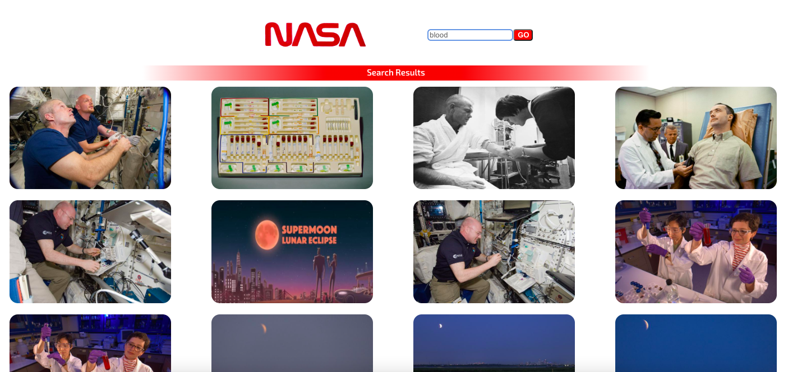
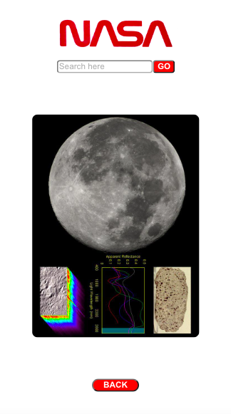
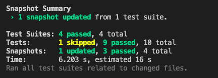

# <div align="center"> NASA Photo Archive 🌍 </div>

<div align="center">An exercise on React - part II 🚀</div>

## Objectives

This project presents the opportunity to develop an app that gets images from a NASA API.




## Planning & Development

For this project I've aimed to deliver a simple design that is responsive and efficient. In order to enhance user experience, I have included a Back To Top button and a route that allows you to expand the image without opening another tab.

I have used the following:
-Axios,
-React Components,
-External React Components (moving-text),
-PropTypes,
-Lodash (Throttle).

## React Router

This project allowed me to experiment with React Router. These are the Routes you can access through the app:

- ### Home Path - "/",
- ### Search Path - "/:q",
  (Where q is the req param for the search).
- ### Inspect Image Path - "/:q/image-detail".

I have really enjoyed playing with Links, and I love that you can store state within them for you to use in different ways. For example, it is the Link element wrapping the images that holds the state for "selectedImage" - that state is used by the Inspect Image component to render the Selected Image in "/:q/image-detail".

## Set Up

I've deployed the app with Vercel. You can find it here: https://nasa-image-search-cm.vercel.app/

If you wish to run this app in your machine follow these steps:

1. Fork this project. Then clone the repo to your machine:

```bash
git clone git@github.com:[your-github-username]/react-tech-test
```

2. Install the project's dependencies:

```bash
npm install
```

3. To run the app in development mode in your http://localhost:3000 run

```bash
npm start
```

## Test Suites

To test the functionality and components of the app, I used React Test Library - I am still researching how to test Router/Routes/Links with React and will update the tests shortly.

This is the latest test result log:

<details>
<summary>Tests</summary>



</details>

### TODO

- Researching how to test Router and its elements in React, updating the tests to be more thorough.
- Implement images maintaining their default aspect ratio and orientation.
- Ensuring the design is fully responsive across multiple devices.
- Adding an error message onscreen if the choosen search term returns no results.
